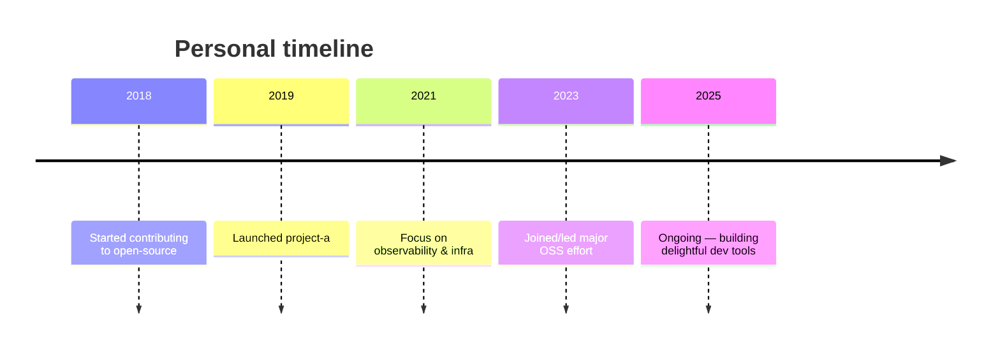

<!--
  README for the `bio` repository of SoroushRF
  - Modern, vibrant, copy-paste-ready
  - Dynamic stats + icons + contribution graph + mermaid timeline
  - Replace any placeholder text (PROJECT, LINK, DESCRIPTION) with your real data
-->

<!-- =========================
     HERO / NAME + ROLES
   ========================= -->
<h1 align="center">
   Hi, I'm SoroushRF
   
  <i>Engineer • Open Source Enthusiast • Designer of neat systems</i>
</h1>

  <!-- visitor count -->
  
  <!-- quick highlights / badges -->
  
  
  

---

<!-- =========================
     SOCIAL LINKS
   ========================= -->

  <!-- Replace links if you have/ want different handles -->
  
  
  
  

---

<!-- =========================
     ABOUT / SHORT BIO
   ========================= -->
## About me
I build reliable, delightful software products and contribute to open-source projects. I enjoy clean architecture, instrumentation, data visualizations, and developer experience. This repo holds my public bio and the canonical README for my GitHub profile.

- 🔭 Currently: Building [PROJECT NAME — add your main project here]
- 🌱 Learning: Modern data viz, observability, and design systems
- 💬 Ask me about: Rust, TypeScript, Node.js, Distributed systems, UX for dev tools
- ⚡ Fun fact: I love turning complex pipelines into simple, testable automations

---

<!-- =========================
     VISUAL STATS CARDS
   ========================= -->
## Visual stats & activity

  <!-- GitHub readme stats (replace theme if you prefer) -->
  
  

  <!-- Contribution heatmap from GitHub -->
  

  <!-- Streak + trophies -->
  
  

Notes:
- The three service images above (GitHub Readme Stats, streaks, trophies) are dynamic and render live. If an image does not load, see Troubleshooting at the end.

---

<!-- =========================
     KEY PROJECTS (VISUALLY RICH CARDS)
   ========================= -->
## Featured projects
> (Replace with your top 3–6 repos. I couldn't fetch the repo list from this session — paste here or allow access for automatic listing.)

- [project-a](https://github.com/SoroushRF/project-a) — One-liner describing purpose, tech, and the impact.  
   

- [project-b](https://github.com/SoroushRF/project-b) — One-liner, link to live demo or docs.  
  

- [project-c](https://github.com/SoroushRF/project-c) — Short summary, why it exists.  
  

Pro tip: For each project, keep 1 short sentence of "why" and 1 of "how" (architectural/contribution angle).

---

<!-- =========================
     TECH STACK (ICONS + BARS)
   ========================= -->
## Tech & tools

  <!-- skill badges (percent-style via shields) -->
  
  
  
  
  

Want a custom icon set or animated SVG badges? I can help produce them and give you a self-hosted fallback for faster load & guaranteed uptime.

---

<!-- =========================
     VISUAL TIMELINE (MERMAID) — optional
   ========================= -->
## Career & open-source timeline

<!-- GitHub supports Mermaid diagrams in READMEs. If your account doesn't render Mermaid, you can remove or convert to an image. -->

---

<!-- =========================
     HOW TO KEEP THIS README FRESH
   ========================= -->
## Keep this README live (automation)
1. Use GitHub Actions to regenerate sections (projects, badges) on push or schedule:
   - Action idea: run a script to fetch your 6 top repos and write them into this README (use octokit + node).
2. Host any custom SVG badges in your repo's /assets and reference them via raw.githubusercontent.com for speed & reliability.
3. Replace placeholders for PROJECT and EMAIL with real values.

Example small action (concept):
- A cron job runs weekly, fetches top 6 repos via GitHub API, renders project cards, and commits README update.

---

<!-- =========================
     TROUBLESHOOTING & NOTES
   ========================= -->
## Troubleshooting (images not loading)
- Confirm the username in each image URL equals your GitHub username (SoroushRF).
- Many widgets are served by third-party services (vercel.app, herokuapp, komarev.com). If an image 404s:
  1. Open the image URL directly in a browser to see the error.
  2. If a service is down, switch to an alternative (self-host the SVG or use shields.io static equivalents).
- To self-host:
  - Generate the SVG (many of these services support exporting) and commit to /assets, then reference like:
    https://raw.githubusercontent.com/SoroushRF/bio/main/assets/github-stats.svg

---

## Final notes
- I couldn't fetch your repositories automatically from this environment. This README is fully copy-paste ready and already uses your GitHub username (SoroushRF) in the dynamic badges and graphs. Paste this into README.md in your bio repo and preview on GitHub.
- If you'd like, I can:
  - Auto-generate the "Featured projects" section by reading your repo list (I will need permission or you can paste a list).
  - Produce custom SVG badges (with consistent theme palette).
  - Provide a GitHub Action workflow to keep the README updated automatically.

Happy to iterate — tell me if you want a specific color theme, different badges, or that I should fetch your repos to auto-fill projects and stats.
